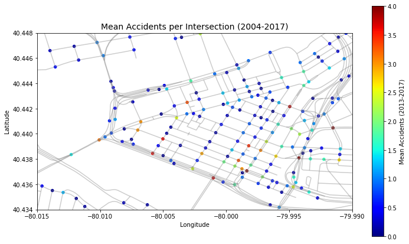
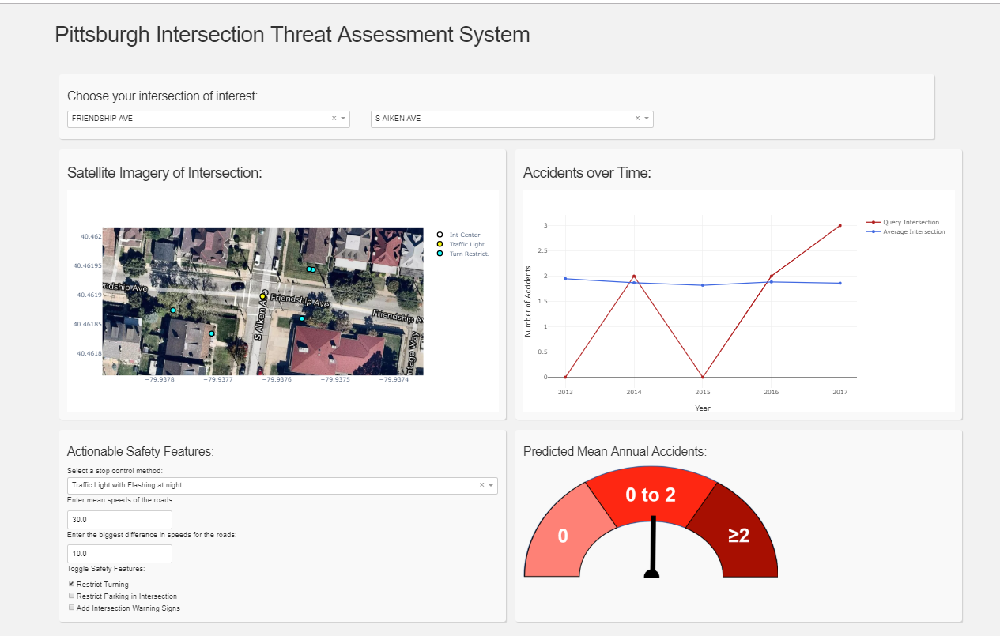

# Pittsburgh Intersection Threat Assessment System (PITAS)
## An automated intersection inspection system 

 

### Introduction:
Despite innovations in automotive safety features and traffic control systems, automotive collisions remain one of the most costly and dangerous problems in the United States. Intersections are particularly dangerous and are where over 40% of traffic collisions occur. In my project, **Pittsburgh Intersection Threat Assessment System (PITAS)**, I propose using city data on traffic collisions, intersection safety features, and intersection geometry to predict the number of collisions that will occur at all intersections of a city, determine which features contribute the most to each intersection's safety rating, and allow city planners to interact with the model. **PITAS could be productized as a municipal decision assistance tool or a tool to help insurance companies set premiums.**

 

### Inputs:

**PITAS** recieves inputs from several disparate datasets:

- Road centerline shapes, road names, speed limits, one way status ([link](https://www.pasda.psu.edu/uci/DataSummary.aspx?dataset=1224))
- Traffic Sign descriptions and locations ([link](https://data.wprdc.org/dataset/city-traffic-signs))
- Traffic Light descriptions and locations ([link](https://data.wprdc.org/dataset/city-of-pittsburgh-signalized-intersections))
- Detailed accident descriptions including locations ([link](https://data.wprdc.org/dataset/allegheny-county-crash-data))
- Zoning information ([link](https://data.wprdc.org/dataset/zoning1))
- 311 Complaint information ([link](https://data.wprdc.org/dataset/311-data))

The ultimate input will combine this information as the following features:

- Number of One-Ways: 'numones', integer
- The mean speed of roads at the intersection: 'meanspeed', float
- The maximum speed differential at the intersection: 'maxdiffspeed', float
- The number of roads at the intersection: 'numroad', integer
- The number of uniquely named roads at the intersection: 'uniroad', integer
- If the intersection has stop signs: 'StopSign', Bool
- The number of stop signs per road at the intersection: 'StopPerWay', float
- If the intersection has a traffic light: 'TrafficLight', Bool 
- If the intersection has a traffic light that has a period of Red/Yellow Flashing: 'TrafficFlash', Bool
- The number of signs restricting turns: 'turnrestriction', integer
- The number of signs restricting parking: 'noparking', integer
- The number of signs alerting drivers to upcoming intersections: 'vissigns', integer
- The number of signs for yielding: 'yielding', integer
- The number of 311 complaints about the intersection since 2015: 'Complaints311', integer
- Categorical encoding columns for the zoning of the intersection:
       'Golden_Triangle_', 'Local_Neighborhood_Commercial_',
       'Neighborhood_Industrial', 'Single-Unit_Attached_Residential',
       'Urban_Industrial', 'Hillside__', 'Specially_Planned',
       'Multi-Unit_Residential', 'Urban_Neighborhood_Commercial', 'Parks',
       'Educational/Medical_Institution', 'Two-Unit_Residential',
       'General_Industrial', 'Planned_Unit_Development',
       'Single-Unit_Detached_Residential', 'General_Industrial__',
       'Highway_Commercial', 'Three-Unit_Residential', 'Neighborhood_Office', Bool
- The latitude of the interesection, 'latitude', float
- The longitude of the intersection, 'longitude', float
- An array of the number of accidents from 2004-2017, 'AccOverTime', Numpy Array
- A list of unique road names at the intersection: 'STlist', list
- A string containing all uniqe road names at the intersection: 'STstr', string
- The mean number of accidents at the intersection (2004-2017): 'numacc', float

 

### Model:
The inputs are fed into a Random Forest Multilabel Classification Model with 3 possible Risk Levels / labels:

1: 0 Accidents Per Year
 
2: 0-2 Accidents Per Year
 
3: >2 Accidents Per Year

This values are generated for each intersection, which serves as the output of the model.

 

### Interactivity:

**PITAS** is hosted at [pitas.herokuapp.com](pitas.herokuapp.com). At the site, you can toggle different features of a particular intersection to see how this could affect the Risk Level. 

 

